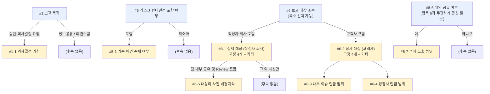

# 요약 보고서 작성

투자 기획서, 사업 기획서, 서비스 제안서 등 수십 페이지 분량의 원본 자료를 요약 보고용으로 재구성할 때 따르는 표준 프로세스입니다. 누구나 동일한 절차로 일관된 품질의 보고서 초안을 만들 수 있도록, 인터뷰 항목을 필수 최소 단위로 압축했습니다.

이 스킬은 `agents/summary-report-doc-reviewer.md` 서브에이전트와 함께 패키징된 플러그인의 일부입니다. Claude Code 또는 이 플러그인을 설치한 Claude Cowork에서는 4단계 자가검토를 그 서브에이전트가 수행하고, 서브에이전트를 실행할 수 없는 환경(claude.ai 웹챗, Claude 데스크톱 앱의 Chat 탭 등)에서는 메인 에이전트가 같은 체크리스트로 직접 수행합니다.

## A. 작업 프로세스 (5단계)

요청이 들어오면 0~4단계를 **단계마다 진행 여부를 되묻지 않고** 순서대로 끝까지 진행한다. 단, **1단계 → 2단계 전환만은 예외**로, 1단계 완료 후 자동으로 2단계(인터뷰)를 시작하지 않고 사용자의 진행 요청을 기다린다 (근거는 아래 1단계 설명 참고).

사용자에게 다시 확인해야 하는 지점은 아래 네 가지뿐이다.
- 0단계: 원본 파일 후보가 여럿일 때의 파일 선택
- 1→2단계 사이: 인터뷰 진행 여부
- B·C절: 인터뷰 항목에 대한 답변
- 되돌리기 어려운 분기 (예: 기존 산출물 재사용 vs 처음부터 다시 작성)

### 0단계 — 원본 파일 식별 및 작업 폴더 준비

**원본 파일 선택**
- 작업 폴더·대화 첨부 파일 중 원본으로 추정되는 파일(PPTX/DOCX/PDF/이미지 등)이 여러 개면 선택형 UI로 확인한다.
- 파일이 하나뿐이거나 사용자가 이미 지목했다면 이 확인은 생략한다.

**작업 폴더 준비 (환경별 분기)**
- 파일시스템 접근 가능 환경(Claude Code 등): `{원본파일명}/` 폴더를 생성하고, 이후 만드는 모든 과정 파일을 그 안에 저장한다. 원본 파일 자체는 옮기지 않는다.
- 파일시스템 접근 불가 환경(claude.ai 채팅, Claude 데스크톱 앱 등): 이 단계는 건너뛰고, 대신 산출물 파일명 앞에 원본 파일명을 붙인다 (`{원본파일명}_상세파악.md` 등).

### 1단계 — 원본 자료 상세 파악

**형식별 유의사항** (읽기 전에 먼저 원본 형식을 확인하고 아래를 반영해 파악 정확도를 조정한다)

| 형식 | 유의사항 |
| --- | --- |
| PPTX | 제목/본문/표 구조와 발표자 노트까지 활용 가능. 가장 정확도가 높음 |
| DOCX | 줄글·목차 구조가 유지되어 파악이 안정적 |
| PDF | 텍스트 레이어 존재 여부부터 확인. · PPTX/DOCX를 그대로 변환한 것: 본문 텍스트는 안정적이나 발표자 노트는 소실, 자유배치형 슬라이드는 제목/본문 구분을 위치·폰트크기로 추정해야 함 · 텍스트 레이어 없는 스캔본: OCR 필요, 수치·표 오인식 위험 큼 |
| 이미지 파일 (JPG/PNG/BMP) | 스캔·촬영본과 동일하게 OCR 필요. 해상도·기울기·그림자에 따라 인식률 편차가 크고 표·숫자 오인식 가능성이 높음 |

**작성 방법**
- 원본을 상세히 읽고 구조화하여 `{원본파일명}_상세파악.md`(마크다운)로 만든다. (0단계 폴더가 있으면 그 안에, 없으면 파일명 그대로)
- 포함 내용: 목차 구조, 슬라이드/섹션별 핵심 내용, 수치·일정, 임원 보고 시 유의할 특이사항(전문용어, 리스크 근거, 외부 의존성 등)
- 목차·섹션 구분과 정보 클러스터링은 4단계 체크리스트의 구조화 원칙(A-4 참고)을 따른다.
- OCR을 거친 형식(PDF 스캔본, 이미지 파일)은 완료 후 수치·표를 원본과 전수 대조한다.

**완료 후: 2단계로 자동 진행하지 않는다**
- 상세파악 산출물을 만들고 나면 그 자리에서 멈춘다. 이어서 바로 인터뷰 질문을 띄우지 않는다 — 최초 요청에 "인터뷰까지 진행해달라"는 말이 포함되어 있었더라도 예외 없이 멈춘다.
- 사용자가 상세파악 내용을 확인할 시간 없이 곧장 인터뷰로 넘어가면, 원본을 잘못 파악한 채로 인터뷰가 진행되는 문제를 사용자가 뒤늦게 발견하게 된다.
- 사용자가 "인터뷰 진행해줘"처럼 다음 단계 진행을 명시적으로 요청하면 그때 2단계를 시작한다.

### 2단계 — 인터뷰 진행

**시작 조건**
- 사용자가 인터뷰 진행을 명시적으로 요청한 뒤에만 시작한다 (위 1단계 "완료 후" 참고). 최초 요청에 이미 인터뷰 진행 의사가 담겨 있었더라도, 1단계 완료 시점에는 반드시 멈추고 별도의 진행 요청을 받은 뒤 시작한다.

**시작 전: 상세파악 결과 먼저 확인시키기**
- 인터뷰 질문 전에 1단계 산출물(`{원본파일명}_상세파악.md`)을 **항상 Artifact로 먼저 띄운다** — 파일시스템 접근 가능 여부와 무관하게 예외 없음.
- Artifact는 마크다운 원문 그대로 퍼블리시한다. 보기 좋은 HTML로 변환하지 않는다 (상세파악은 원문 대조가 우선인 중간 산출물이므로).
- 산출물이 이미 폴더에 저장돼 있어도, 사용자가 직접 열어보지 않았다면 확인한 것이 아니므로 생략하지 않는다.

**진행 방식**
- B절의 9개 필수 항목을 확인하고, 답변에 따라 조건부 후속 질문을 진행한다.
- 문서 성격에 따라 필요하면 C절의 옵션 항목도 추가로 확인한다.
- 항목 2·3은 조직 내 "임원 프로필"로 한 번 구축해두면 이후에는 이름만 선택하는 방식으로 축소할 수 있다.
- 모든 항목(자유 서술 포함)을 선택형 UI(예시 보기 + "기타" 직접입력)로 진행한다. 보기에 없는 답변은 "기타"로 받으면 되므로 평문 질문은 따로 두지 않는다. 선택형 UI 도구가 없는 환경에서는 번호를 매긴 보기 목록 + "기타(직접 입력)"를 채팅 텍스트로 제시하는 방식으로 대체한다.
- 한 번의 선택형 질문에 여러 항목을 묶어(batch) 진행한다. 단, 특정 항목에서 제출이 막히는 등 문제가 생기면 그 항목부터는 하나씩 나눠 진행한다.

**인터뷰 종료 후 확인 절차** (아래 순서를 절대 건너뛰거나 뒤바꾸지 않는다)

1. 인터뷰(최초 진행이든, 수정 후 재질문이든) 답변을 모두 받는다.
2. 전체 답변을 **표로 정리해 일반 채팅 텍스트로만** 출력한다.
   - 이 응답에는 선택형 질문 호출을 **함께 넣지 않는다.**
   - 이유: 표 출력과 확인 질문 호출을 같은 도구 호출 묶음에 섞으면, 사용자가 표를 보기 전에 확인 질문이 뜨는 순서 오류가 생긴다.
3. 표를 출력한 **다음** 차례에 "이대로 진행할지, 수정할 항목이 있는지" 확인하는 선택형 질문을 띄운다.
4. "수정하겠다"는 답이 오면 어떤 항목인지 확인해 해당 항목만 다시 질문한다.
5. 항목을 다시 질문했으면 **2번부터 다시 반복**한다.
   - 바뀐 항목 하나만 언급하고 곧장 확인 질문으로 넘어가지 않는다.
   - 전체 표를 처음부터 다시 출력한 뒤 확인 질문을 잇는다.
   - 부분표나 "변경된 항목만" 요약으로 대체하지 않는다.
6. 사용자가 "그대로 진행"을 선택할 때까지 2~5번을 몇 번이든 반복한다.

### 3단계 — 보고서 초안 작성

- 인터뷰 결과를 반영해 `{원본파일명}_보고서초안.md`(마크다운)로 만든다. (0단계 폴더가 있으면 그 안에, 없으면 파일명 그대로)
- 실제 문서/슬라이드 제작(디자인 툴 작업)은 이 초안이 승인된 뒤 별도로 진행한다.
- 초안 맨 앞부분(제목·형식 요약 다음)에 "인터뷰 결과" 섹션을 두고, 2단계에서 확정한 답변을 채팅에 출력했던 것과 같은 표 형태(`#` / 항목 / 답변 3열)로 옮겨 기록한다. 트리거되지 않은 조건부 항목은 표에 넣지 않는다.
- 인터뷰 도중 답변을 수정한 경우에도 이 표에는 **최종 확정된 답변만** 담는다 — 수정 전 답변이나 변경 이력은 넣지 않는다 (수정 과정 자체는 대화 내에서만 다루어지고 산출물에는 남기지 않음).
- 작성 중에는 4단계의 맞춤화·구조화·명확화·실행화 체크리스트를 **사후 채점 기준이 아니라 설계 기준**으로 미리 대조하며 쓴다.
  - 예: 섹션 헤드라인을 결론형으로 쓰는 것 = 명확화 체크("첫 문장/첫 섹션에 결론이 담겼는가")를 미리 충족
  - 예: 섹션 골격 순서를 따르는 것 = 구조화 체크("정보가 논리적 순서로 배치됐는가")를 미리 충족

**섹션 구성 요소** (초안은 섹션별로 아래를 포함한다)
- 섹션 헤드라인 — 핵심 메시지를 담은 결론형 제목(Action Title). 예: "시장 분석"(X) → "EMEA 공격적 투자 시 2026년까지 매출 30% 성장 가능"(O)
- 본문 내용(표/불릿)
- 발표 시 강조 포인트

**기본 섹션 골격** (항목 4에서 "상세보고서 10p 내외"를 선택한 경우)

| 순서 | 섹션 | 내용 |
| --- | --- | --- |
| 1 | Executive Summary | 핵심 결론 3~5줄 (전체 분량의 10% 이내) |
| 2 | Purpose / Background | 이 보고를 지금 하는 이유 |
| 3 | Current Status & Issues | 현황과 문제의 심각성 |
| 4 | Options & Analysis | 대안 2~3개 비교 (장단점·비용·리스크) |
| 5 | Recommendation | 추천안과 근거 |
| 6 | Business Impact | 매출/비용/리스크/일정 등 임원 언어로 환산 |
| 7 | Next Steps | 담당자·기한을 명시한 실행 계획 |

> 1페이지 요약·요약 슬라이드에서는 Executive Summary와 Recommendation을 앞부분에 통합하고, 나머지는 필요한 것만 압축한다.

### 4단계 — 자가 검토

초안 완성 후 아래 체크리스트로 자가 점검하고, 미흡한 항목은 다시 다듬은 뒤 공유한다.

**호출 방식 (환경별 분기)**
- 서브에이전트 실행 가능 환경(Claude Code, 이 플러그인을 설치한 Claude Cowork 등): 이 점검을 직접 하지 않고 항상 `summary-report-doc-reviewer` 서브에이전트를 호출해 결과를 받는다 (정의는 D절 참고).
- 서브에이전트 실행 불가 환경(claude.ai 웹챗, Claude 데스크톱 앱의 Chat 탭 등): 메인 에이전트가 같은 체크리스트로 직접 점검한다. 이 경우 작성자 본인이 스스로 채점하는 구조라 서브에이전트를 통한 편향 방지 효과는 없다는 점을 감안한다.

**체크리스트 (맞춤화·구조화·명확화·실행화)**

**맞춤화**
- [ ] 인터뷰에서 확인한 대상의 화법·톤(항목 3·3-1)이 초안에 반영됐는가?
- [ ] 분량·형식(항목 4)과 콘텐츠 깊이(항목 9)가 정한 범위를 지켰는가?
- [ ] 리스크·반대관점 포함 여부(항목 5)가 정한 대로 반영됐는가?
- [ ] 이 보고를 지금 하는 이유(Purpose/Background)가 분명히 제시됐는가?

**구조화**
- [ ] 정보가 논리적 순서로 배치됐는가(결론 → 근거 → 실행)?
- [ ] 관련 정보가 섹션별로 묶여 있는가?
- [ ] 헤딩·표·강조로 한눈에 스캔 가능한가?
- [ ] 필요한 정보를 바로 찾을 수 있는가?

**명확화**
- [ ] 첫 문장/첫 섹션에 결론이 담겼는가?
- [ ] 형용사 대신 수치로 표현했는가?
- [ ] 명사형 표현(~요청, ~진행, ~필요 등)을 동사형으로 바꿨는가?
- [ ] 수동 표현(~에 의해, ~이 되다 등)을 능동 표현으로 바꿨는가?
- [ ] '가급적', '빠른 시일 내', '가능한 방향' 같은 모호 표현이 남아있지 않은가?
- [ ] 판단 기준·조건을 수치나 명확한 잣대로 제시했는가?
- [ ] 문장이 짧고 직관적인가? 불필요한 수식어·중복 표현은 없는가?

**실행화**
- [ ] 수치·용어 오류를 재확인했는가?
- [ ] 예상 질문(Q&A)에 대한 답변을 준비했는가?
- [ ] 파일 서식·표·이미지가 배포 환경(뷰어, 인쇄 등)에서 깨지지 않는지 확인했는가?
- [ ] 배포 경로(누구에게 어떤 방식·기한으로 전달되는지)를 확인했는가?
- [ ] 독자가 추가 확인 없이 바로 다음 행동(승인/실행)에 나설 수 있도록 필요한 근거·정보가 모두 문서 안에 있는가?

**결과 기록**
- 자가 검토 결과는 별도로 보고하지 않는다.
- `{원본파일명}_보고서초안.md` 본문 **가장 마지막**에 "자가 검토 결과" 섹션으로 기록한다 (체크 항목별 결과를 표로 정리).
- 미흡해서 다시 다듬은 경우에도 다듬은 뒤의 최종 판단을 기록한다.

## B. 인터뷰 항목 (9개 필수 + 조건부 후속 질문)

### 필수 항목 1~9

| # | 항목 | 형식 | 선택 방식 | 설명 |
| --- | --- | --- | --- | --- |
| 1 | 보고 목적 | 선택형 | 단일 선택 | 정보공유(FYI) / 의견수렴 / 승인·의사결정 요청 — 승인요청형이면 "결정해야 할 사항"을 최상단에 배치. **승인요청형이면 조건부 질문 1-1로 이어간다** |
| 2 | 핵심 메시지·결론 선(先)제시 여부 | 선택형 | 단일 선택 | 두괄식(결론 우선) / 배경부터 순차 전개 — 보고서의 구조 순서 자체를 결정 |
| 3 | 임원 의사결정 스타일 | 선택형 | 단일 선택 | 결론·숫자중심 두괄식 / 논리적 전개·맥락 선호 / 리스크·이슈 중심 |
| 4 | 보고 형식·분량 | 선택형 | 단일 선택 | 1페이지 요약 / 요약 슬라이드 3~5장 / 상세보고서 10p 내외 |
| 5 | 리스크·반대관점 포함 여부 | 선택형 | 단일 선택 | 포함 / 최소화. **"포함"을 선택하면 조건부 질문 5-1로 이어간다** |
| 6 | 보고 대상 소속 | 선택형 | 복수 선택 가능 | "작성자 회사 내부" / "고객사" — 대상이 양쪽 모두에 걸치면 복수 선택. 답변에 따라 6-1·6-2 중 해당하는 하위 질문으로 이어간다 |
| 7 | 발표 동반 여부 | 선택형 | 단일 선택 | 구두 발표와 함께 전달 / 서면 단독 배포(임원이 혼자 읽음) — 서면 단독이면 문서 자체가 모든 맥락을 자기완결적으로 담아야 하므로 설명 수준을 높인다 |
| 8 | 보고 이력 | 선택형 | 단일 선택 | 최초 보고 / 재보고(이전에 보고된 적 있음) — 재보고면 배경 설명을 최소화하고 "지난 보고 대비 변경·진전 사항" 중심으로 구성한다 |
| 9 | 콘텐츠 깊이 선호 | 선택형 | 단일 선택 | 전략·방향 중심(실무 세부사항 최소화) / 실무 세부사항 포함(구현방법·일정·리소스 등 상세) / 혼합(본문은 전략 중심, 부록에 실무 상세 첨부) — **보고 대상의 직급과 무관하게 별도로 확인한다** (임원이라도 실무 디테일을 원할 수 있고, 실무자 대상이라도 전체 방향만 필요할 수 있음) |

### 조건부 후속 질문

| # | 항목 | 형식 | 선택 방식 | 트리거 조건 및 설명 |
| --- | --- | --- | --- | --- |
| 1-1 | 의사결정 기한 | 조건부 · 선택형 + 기타 입력 | 단일 선택 | **트리거**: 항목 1 = "승인·의사결정 요청" **질문**: "언제까지 결정이 필요한가요?" — 기한이 있으면 초안에서 긴급도와 "왜 지금 결정해야 하는가"를 명시적으로 다룬다 |
| 3-1 | 맞춤 스타일 상세 | 선택형 + 기타 입력 | 복수 선택 가능 | 이 임원만의 화법·금기어를 확인한다. **예시 보기**: "전문용어 사용 지양", "정량적 표현(숫자·%) 우선 선호", "부정적 표현 대신 개선방향 중심 서술", "특이사항 없음" 목록에 없는 디테일은 "기타"로 자유 서술을 받는다. 화법 특성이 여러 개 겹칠 수 있으므로 복수 선택을 허용한다 |
| 5-1 | 기존 이견 존재 여부 | 조건부 · 선택형 + 기타 입력 | 단일 선택 | **트리거**: 항목 5 = "포함" **질문**: "이 안건에 대해 이미 반대하거나 다른 의견을 가진 부서/임원이 있나요?" — 있다면 초안에서 해당 이견을 선제적으로 언급하고 대응 논리를 배치한다 |
| 6-1 | 보고 대상 상세 (작성자 회사) | 조건부 · 선택형(고정 목록) + 기타 입력 | 복수 선택 가능 | **트리거**: 항목 6에 "작성자 회사 내부" 포함 **보기**: 최고 경영진(대표이사) / 경영진(본부장,사업부장) / 인사관리자(실장,담당,팀장,파트장) / 팀 내부 공유 및 Review — 없는 대상은 "기타" **"팀 내부 공유 및 Review"를 선택하면 조건부 질문 6-5로 이어간다** |
| 6-2 | 보고 대상 상세 (고객사) | 조건부 · 선택형(고정 목록) + 기타 입력 | 복수 선택 가능 | **트리거**: 항목 6에 "고객사" 포함 **보기**: 최고 경영진(대표이사) / 경영진(본부장,사업부장) / 인사관리자(실장,담당,팀장,파트장) / 실무자 — 없는 대상은 "기타" **이 질문에 답하면 조건부 질문 6-3·6-4로 이어간다** |
| 6-3 | 내부 이슈 언급 범위 | 조건부 · 선택형 | 단일 선택 | **트리거**: 항목 6에 "고객사" 포함 **질문**: "자사 내부 조직·인력·운영 이슈를 이 보고서에 언급해도 되나요?" — 언급 가능 / 순화해서 언급 / 언급하지 않음(배제) |
| 6-4 | 경쟁사 언급 범위 | 조건부 · 선택형 | 단일 선택 | **트리거**: 항목 6에 "고객사" 포함 **질문**: "경쟁사명을 직접 언급해도 되나요?" — 실명 언급 가능 / 익명화("일부 경쟁사") / 언급하지 않음 |
| 6-5 | 대상의 사전 배경지식 | 조건부 · 선택형 | 단일 선택 | **트리거**: 항목 6-1에 "팀 내부 공유 및 Review" 포함 **질문**: "이 대상이 안건에 대한 사전 배경지식이 있나요?" — 있음(진행상황 인지) / 없음(처음 접함) — 없으면 Purpose/Background를 상세화 |
| 6-6 | 대외 공유 여부 | 선택형 | 단일 선택 | **트리거 없음 — 항목 6과 무관하게 모든 보고서에서 확인** **질문**: "이 보고서가 회사 밖으로도 공유되나요?" — 예 / 아니오. **"예"를 선택하면 조건부 질문 6-7로 이어간다** |
| 6-7 | 수치 노출 범위 | 조건부 · 선택형 | 단일 선택 | **트리거**: 항목 6-6 = "예" **질문**: "매출·비용 등 구체 수치를 그대로 노출해도 되나요?" — 그대로 노출 / 비율·범위로만 표현 / 수치 자체 제외 |

### 인터뷰 분기 흐름도

9개 필수 항목 중 1·5·6은 조건부 후속 질문을 유발한다. 특히 항목 6은 답변 조합에 따라 최대 4단으로 갈라지므로, 배치 질문 진행 중 어떤 후속 질문이 열려야 하는지 판단할 때 아래 흐름도로 대조한다.

- 파란 노드(#1·#5·#6·#6-6)는 모든 인터뷰에서 항상 묻는 필수 항목이다. 노란 노드는 위 조건을 만족할 때만 열리는 조건부 후속 질문이다.
- 항목 2·3·3-1·4·7·8·9는 조건부 분기가 없어 흐름도에서 제외했다 — 매번 동일하게 질문한다.
- 항목 6은 복수 선택이므로 "작성자 회사"와 "고객사"를 동시에 선택하면 6-1·6-2가 모두 열리고, 6-1에서 "팀 내부 공유 및 Review"까지 겹치면 한 인터뷰에서 6-1·6-2·6-3·6-4·6-5가 동시에 열릴 수 있다 — 이 조합을 놓치기 가장 쉬우므로 배치 질문을 구성할 때 특히 유의한다.
- 항목 6-6(대외 공유 여부)은 항목 6의 하위 질문이 아니라 모든 보고서에 공통으로 묻는 별도 필수 질문이다.

### 항목 6-1 · 6-2 고정 선택지

아래 값은 매번 동일하게 제시한다 (인터뷰 때마다 목록을 새로 생성하지 않음). 각 목록이 정확히 4개라 선택형 질문 한 번(옵션 최대 4개)에 그대로 담긴다.

표에 없는 대상은 "기타"로 직접 입력을 받되, 같은 "기타" 응답이 반복되면 이 표 자체에 값을 추가해 갱신한다.

> "대외 공유용"은 특정 대상 그룹이 아니라 배포 범위의 문제이므로 고정 목록에서 빼고 항목 6-6(대외 공유 여부)으로 독립시켰다.

| 구분 | 보고 대상 (6-1: 작성자 회사) |
| --- | --- |
| 작성자 회사 | 최고 경영진 (대표이사) |
| 작성자 회사 | 경영진 (본부장, 사업부장) |
| 작성자 회사 | 인사관리자 (실장, 담당, 팀장, 파트장) |
| 작성자 회사 | 팀 내부 공유 및 Review |

| 구분 | 보고 대상 (6-2: 고객사) |
| --- | --- |
| 고객사 | 최고 경영진 (대표이사) |
| 고객사 | 경영진 (본부장, 사업부장) |
| 고객사 | 인사관리자 (실장, 담당, 팀장, 파트장) |
| 고객사 | 실무자 |

## C. 옵션 항목 (필요한 경우에만 질문)

아래 항목은 모든 보고서에 해당하지 않으므로 기본 인터뷰에는 포함하지 않는다. 원본 자료나 앞선 답변에서 관련성이 감지될 때만 추가로 질문한다.

| 항목 | 형식 | 선택 방식 | 언제 질문하나 |
| --- | --- | --- | --- |
| 배포 범위·보안 등급 | 선택형 | 단일 선택 | 대외비/기밀 성격이 있거나, 배포 대상을 특정 인원으로 제한해야 하는 조직·안건일 때 |
| 비교·벤치마크 데이터 포함 여부 | 선택형 | 단일 선택 | 원본 자료에 경쟁사·타 부서·과거 실적 비교 데이터가 이미 존재하거나, 항목 3에서 "결론·숫자중심" 스타일을 선택했을 때 |

## D. 서브에이전트 정의

| 항목 | 내용 |
| --- | --- |
| 서브에이전트 | `summary-report-doc-reviewer` |
| 담당 단계 | 4단계 — 자가 검토(Self-Reflection) |
| 입력 | 완성된 `{원본파일명}_보고서초안.md`, 검증용 `{원본파일명}_상세파악.md`, 인터뷰 답변 요약(채팅에만 있어 메인 에이전트가 프롬프트에 직접 포함해 전달) |
| 출력 | 맞춤화·구조화·명확화·실행화 항목별 pass/fail, 인용 근거, 심각도(치명/경미) |
| 호출 조건 | 항상 사용 (작성자 본인의 확증편향 방지 목적) |
| 환경 제약 | 서브에이전트 실행 가능 환경(Claude Code, 이 플러그인을 설치한 Claude Cowork 등)에서만 동작한다. 서브에이전트 실행 불가 환경(claude.ai 웹챗, Claude 데스크톱 앱의 Chat 탭 등)에서는 서브에이전트를 호출하는 대신 메인 에이전트가 같은 체크리스트를 직접 수행한다 |

검토 결과는 별도로 보고하지 않고, `{원본파일명}_보고서초안.md` 본문 가장 마지막 "자가 검토 결과" 섹션에 기록한다. 미흡해서 다시 다듬은 경우에도 다듬은 뒤의 최종 판단을 기록한다.
